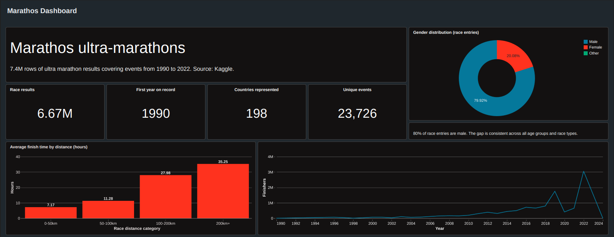
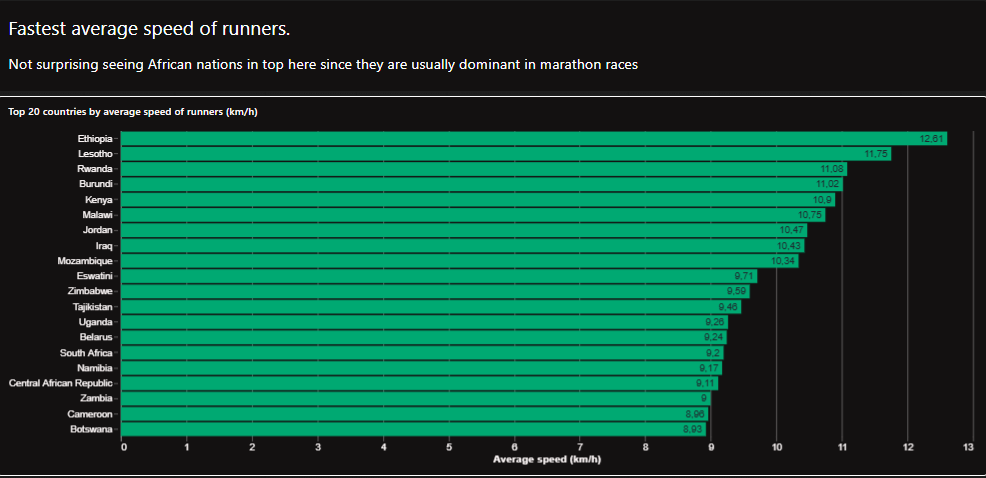
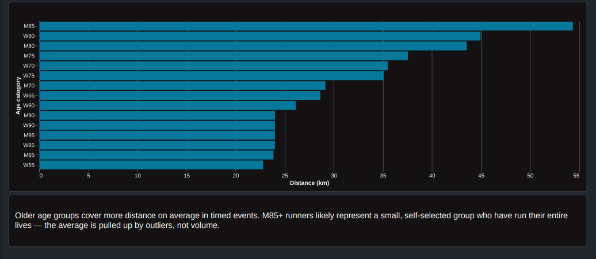
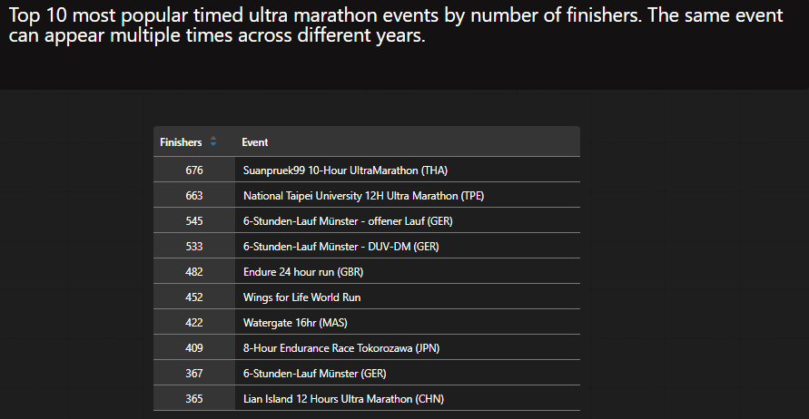
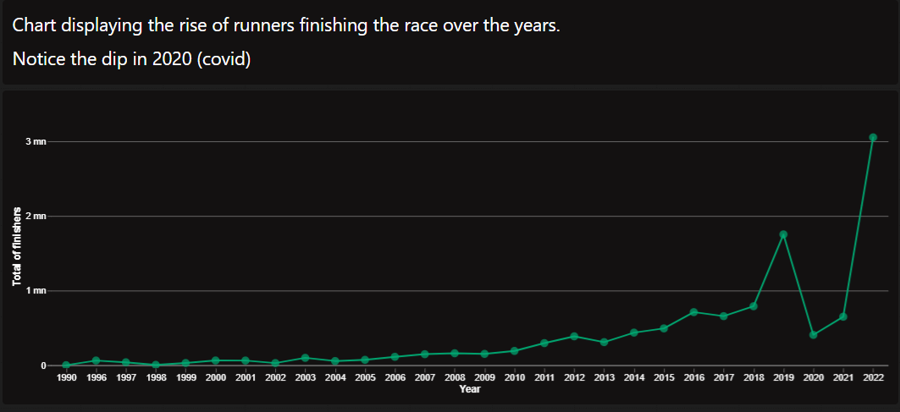
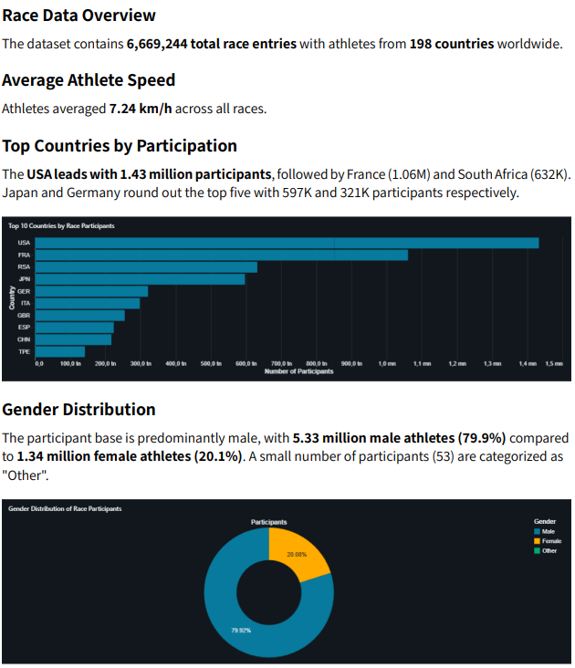

# Marathos Lab

Medallion pipeline for ultra marathon race data built on Databricks with Delta Live Tables.

## Dataset

7.4M rows of ultra marathon results covering events from 1798 to 2022. Source: Kaggle.
Additional dataset added manually: Stockholm Marathon 2024 (15 participants).

## Pipeline

```
Volume (CSV) → Bronze → Silver → Gold → Genie / Dashboard
```

All layers run as a single DLT pipeline with wildcard source (`transformations/**`).

## Layers

**Bronze** (`marathos.bronze.races`)  
Raw ingestion via `readStream` from volume. Schema inferred from a static read and passed to the stream. Column mapping enabled for column names with spaces.

**Silver** (`marathos.silver.races_clean_obt`)  
6.67M rows after cleaning (~10.6% dropped). Key transformations:
- Unit standardization: `Miles/Mile` → `mi`, trailing `k` -> `km`, `mi` -> `km` conversion
- `event_unit` extracted as separate column before distance cast
- Performance converted to decimal hours (distance races) or decimal km (timed races)
- Dates: start date extracted from interval format, parsed to `DateType`
- Gender mapped: `M/F/X` -> `Male/Female/Other`, unknown -> `null`
- Year of birth outside 1700–2005 -> `null`
- `event_country` extracted via regex from event name
- `event_id` and `athlete_id` generated with `sha2`
- Relay races, distances > 500, and rows with invalid characters dropped

**Gold** (`marathos.gold`)  
Dimensional model:

| Table | Description |
|---|---|
| `fct_results` | One row per athlete result |
| `dim_event` | One row per unique event, `MAX` on finishers/dates |
| `dim_athlete` | One row per unique athlete, `MAX` on mutable attributes |
| `dim_date` | Calendar dimension covering 1900–2030, joinable on `event_dates` |


Analytical views:
- `v_distance_speed_by_country` — avg speed per country, distance races
- `v_distance_avg_time_by_bucket` — avg finish time per distance bucket
- `v_time_avg_distance_by_age` — avg distance per age category, timed races
- `v_time_top_events_by_finishers` — top 10 timed events by finisher count

## Genie

Gold tables linked to a Databricks Genie space for ad hoc questions. Answers verified manually in `explorations/genie_validation`. Key findings:
- Genie initially returned incorrect aggregations (summing `event_number_of_finishers` instead of counting rows)
- After rephrasing queries with explicit column and table references, all answers matched manual calculations

## Dashboard







Genie space with verified answers:



## Structure

```
transformations/
  bronze/     DLT ingestion
  silver/     cleaning and standardization
  gold/       dimensional model + analytical views
explorations/
  eda_bronze
  silver_validation
  genie_validation
dimensional_modeling/
  model.dbml
  _Dimensional modeling.png
utils/
  utils.py
  country_codes.py
assets/
  dashboard.png
  genie_dashboard.png
```

## Sources

- Course material: [AIgineerAB](https://github.com/AIgineerAB/cloud_databricks_azure_course)
- Date dimension: [Build & Refresh a Calendar Dates Table — Databricks Community](https://community.databricks.com/t5/community-articles/build-amp-refresh-a-calendar-dates-table/td-p/90809)
- Peer discussions: class Discord
- LLM assistance: Claude (Anthropic) — used for code review, debugging and smaller implementations